# Personalized Recommendation Systems with Matrix Factorization and Latent Factors

### Ejelonu Benedict Ositadinma 1

## Abstract

This paper introduces a personalized movie recommendation system built using the MovieLens 25M dataset. Employing matrix factorization optimized with Alternating Least Squares (ALS), the model learns user and movie biases alongside latent factor representations, effectively capturing complex user preferences. Performance evaluation using Root Mean Squared Error (RMSE) shows significant improvements over baseline methods. The system also demonstrates the ability to recommend relevant long-tail movies, enhancing user discovery and satisfaction. The source code for the implementation is available on Github.

## 1. Introduction

In today's data-driven landscape, personalized recommendations play a crucial role in enhancing user engagement and exposing users to a broader range of options. This is particularly relevant for large-scale datasets like MovieLens, where ratings often follow a power-law distribution—dominated by a few popular movies while many lesser-known titles remain underrepresented. Personalized recommendation systems aim to address this imbalance by surfacing long-tail items that are well-suited to individual users but overshadowed by more popular choices.

In this study, we analyze the MovieLens 25M dataset, starting with an examination of its rating distribution to identify patterns such as scale-free properties and power-law trends. We structure the dataset for efficient indexing by users and movies, facilitating the development of a recommendation model. Using an alternating least squares (ALS) optimization technique, the model estimates user and item biases

1African Institute for Mathematical Sciences (AIMS) South Africa, 6 Melrose Road, Muizenberg 7975, Cape Town, South Africa. Correspondence to: Ulrich Paquet <ulrich@aims.ac.za>.

while incorporating latent factor representations to capture underlying patterns. Regularization is applied in the loss function to manage model complexity and prevent overfitting. We evaluate the model's performance by tracking metrics such as negative log-likelihood and root mean squared error (RMSE) during training, splitting the dataset into training and testing subsets, and analyzing RMSE trends to detect potential overfitting.

Our investigation explores how parameters such as latent dimensions, regularization weights, and user behavior affect recommendation accuracy. Finally, we assess the model's practical relevance by generating recommendations based on a user's five-star rating for a popular movie, examining whether related titles appear among the top suggestions. This work highlights the effectiveness of personalized recommendation systems in enhancing user experience, increasing engagement, and bringing attention to niche content.

## 2. Literature Review

With an emphasis on methods applicable to big datasets like MovieLens and the problem of long-tail item selection, this section examines the body of research applicable to personalized recommendation systems. Long-tail phenomena, regularization strategies, optimization algorithms, matrix factorization, collaborative filtering, and evaluation metrics are all explored.

#### 2.1. Collaborative Filtering and Matrix Factorization

Collaborative filtering (CF) is a widely adopted technique for building recommendation systems, leveraging the preferences of similar users to predict items a target user might find appealing. Matrix factorization (MF) is a prominent approach within CF, aiming to decompose the user-item interaction matrix into lower-rank matrices representing user and item latent factors. This dimensionality reduction is particularly effective for handling the sparsity inherent in recommendation datasets. Koren, Bell, and Volinsky (Koren et al., 2009) provide a comprehensive overview of MF techniques, including various optimization methods and regularization strategies, establishing a foundational understanding of the approach central to this work. While focusing on

item-based CF, Sarwar et al. (Sarwar et al., 2001) offer valuable context by situating MF within the broader landscape of collaborative filtering algorithms and their applicability to recommendation tasks.

#### 2.2. Alternating Least Squares (ALS)

Alternating Least Squares (ALS) is a commonly employed optimization algorithm for MF. It iteratively optimizes user and item latent factors by holding one set of factors constant while solving for the other, effectively transforming a nonconvex optimization problem into a series of simpler convex subproblems. This iterative process converges to a local minimum of the objective function. Zhou et al. (Zhou et al., 2008) demonstrate the application of ALS in the context of the Netflix Prize competition, showcasing its scalability and effectiveness for handling massive datasets, a key consideration for this project utilizing the MovieLens 25M dataset.

#### 2.3. Addressing the Long Tail

The long tail phenomenon, characterized by a power-law distribution of item popularity with a few highly popular items and a large number of less popular items, presents a significant challenge for recommendation systems. Traditional algorithms often struggle to recommend these longtail items, leading to a concentration of recommendations on popular items and limiting user discovery. Anderson (Anderson, 2006) popularized the concept of the long tail and its implications for various industries, emphasizing the importance of catering to niche interests and providing access to a broader selection of items. Brynjolfsson, Hu, and Smith (Brynjolfsson et al., 2006) provide an empirical analysis of the long tail in online markets, demonstrating its economic significance and the potential for increased consumer welfare through enhanced product discovery.

## 2.4. Regularization and Overfitting

Overfitting, where a model performs well on training data but poorly on unseen data, is a common challenge in machine learning. Regularization techniques mitigate this issue by adding a penalty term to the loss function, discouraging overly complex models and promoting generalization. This is particularly relevant in high-dimensional settings with limited data. Hastie, Tibshirani, and Friedman (Hastie et al., 2009) offer a comprehensive overview of statistical learning techniques, including various regularization methods such as L1 and L2 regularization, providing the theoretical background for understanding their impact on model performance.

## 2.5. Evaluation Metrics

Evaluating the performance of recommendation systems requires appropriate metrics. Root Mean Squared Error (RMSE) is a commonly used metric for measuring the accuracy of predicted ratings, quantifying the average difference between predicted and actual ratings. Gunawardana and Shani (Gunawardana & Shani, 2015) provide a detailed survey of various accuracy evaluation metrics used in recommendation systems, including RMSE and other relevant metrics, offering a broader perspective on performance assessment.

This review on the literature highlights the main issues and conventional approaches used in personalized recommendation systems, giving the current work a contextual framework. For addressing the unique difficulties of personalized recommendation in massive datasets like MovieLens, the referenced works provide helpful knowledge on collaborative filtering, matrix factorization, ALS optimization, long-tail recommendation, regularization, and evaluation metrics.

## 3. Exploratory Data Analysis

## 3.1. The MovieLens Dataset

For the purpose of this project, The MovieLens 25M dataset, provided by GroupLens Research was utilized. MovieLens is one of the most widely used datasets for developing and benchmarking recommendation systems. It includes millions of user ratings and metadata on thousands of movies, making it ideal for analyzing user preferences and item popularity.

Each user in the dataset has rated a minimum of 20 movies, allowing for meaningful exploration of user biases and preferences, as well as item-specific trends. The dataset's scale offers an opportunity to test recommendation models under realistic conditions, with challenges such as sparsity, popularity bias, and variability in user activity levels.

The dataset, derived from MovieLens, comprises a total of 25,000,095 ratings spanning 62,423 movies. These ratings were contributed by 162,541 users, making it a rich and diverse source of information for recommendation tasks. The data is stored in a UTF-8 encoded comma-separated values (*.csv) format, ensuring compatibility and ease of processing with standard data analysis tools.

The distribution for the User rating is shown in Figure 1 as well as that for the Movie rating in Figure 2.

One of the most notable findings from the dataset analysis is the unequal distribution of user ratings, as shown in Figure 1. A small number of highly active users account for the bulk of ratings, while the majority of users contribute

sporadically. This imbalance in user engagement not only emphasizes the variability in user behavior but also highlights the sparsity inherent in the dataset.

Figure 2 highlights that a small fraction of movies accumulates the majority of user ratings, while most movies receive far fewer ratings. This characteristic, often described as a "long-tail" distribution, is a fundamental challenge in recommendation systems. It underscores the importance of designing models that can effectively recommend both popular and less popular items, ensuring broader coverage of the catalog.

Similarly, movie activity follows a comparable pattern, depicted in Figure 2. Figure 2 highlights that a small fraction of movies accumulates the majority of user ratings, while most movies receive far fewer ratings. This characteristic, often described as a "long-tail" distribution, is a fundamental challenge in recommendation systems. It underscores the importance of designing models that can effectively recommend both popular and less popular items, ensuring broader coverage of the catalog. Addressing such sparsity is crucial for building robust recommendation models that perform well even for less active users.

From the figures shown in Figure 1 and Figure 2, it can be seen that both distributions follow a power law.

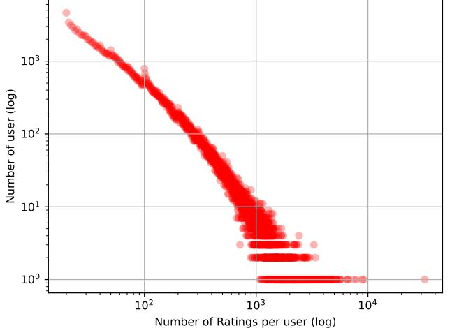

Figure 1. User ratings Power Law

To gain insight into the distribution of user ratings in the dataset, Figure 3 was generated. The plot reveals a notable trend: users predominantly assign ratings within the 3 to 4-star range. This observation indicates a general tendency for users to rate movies positively, suggesting a bias towards moderate to high satisfaction levels.

Figure 4 illustrates the distribution of movies across various genres in the dataset. Notably, movies classified under the 'IMAX' genre appear to be the most prevalent, highlighting

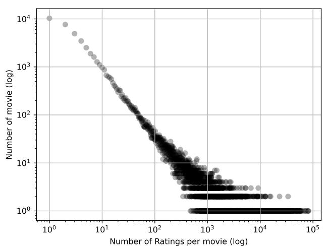

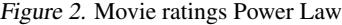

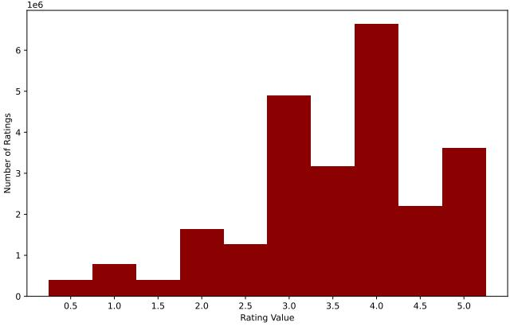

Figure 3. Ratings distribution

their prominence in the dataset. In contrast, movies categorized as 'Drama' are the least prevalent, reflecting a lower representation within the data.

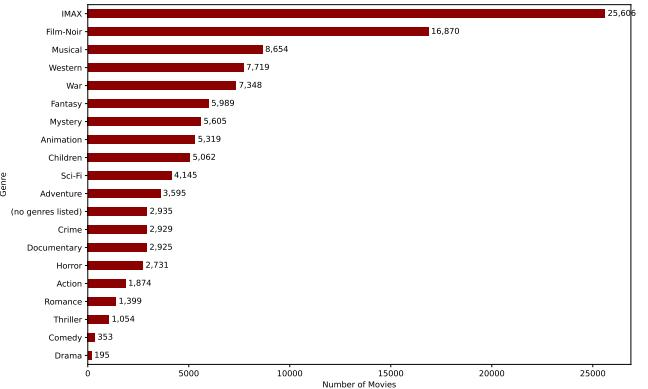

Figure 4. Distribution by Genre

#### 3.2. Data Preprocessing and Preparation

To properly prepare the data for training and evaluation, a number of preprocessing activities were carried out prior to training the recommendation model.

Initially, each user and movie in the dataset was given a unique index. During model training, this indexing accelerated the retrieval of user and movie information and made it easier to create user-item interaction matrices.

Two distinct structures were created from the user-item interaction data: one for users and another for movies. Lists of tuple arrays made up each structure. Each array in the user list represented a user's interactions with movies, and each tuple included the user's rating and the movie index.

In the same way, each array in the movie list reflected a movie's interactions with users, with each tuple holding the user index and the rating that was given to the film. This organized form made it easier to develop collaborative filtering algorithms and allowed for effective access to useritem pairs. To improve vectorization efficiency, a secondary array was also used to enable multi-index operations.

In order to assess the performance of the recommendation model, the dataset was finally divided into training and testing sets. To distribute some of the user-item interactions to the test set while preserving the overall rating distribution, a random sampling technique was used.

The user-item interaction data can be represented as follows:

Users Array: $\begin{bmatrix}\{(1,4.5),(2,3.0),(3,5.0),...\}\\ \{(2,4.0),(4,3.5),(4,1.5),...\}\\ \{...\},\\ \{(1,5.0),(3,4.0),(5,4.5),...\}\end{bmatrix}$  
  

$$\begin{bmatrix}\{(1,4.5),(3,5.0),...\},\\ \{(1,3.0),(2,4.0),...\},\\ \{(1,5.0),(2,3.5),...\},\\ \{(2,3.5),(3,5.0),...\},\\ \{...\},\\ \{(3,4.5),(2,3.0),...\}\end{bmatrix}$$

Here, each row in the first matrix corresponds to a user and their interactions with movies, while each row in the second matrix corresponds to a movie and its interactions with users. Each tuple contains an index and a rating.

#### 3.3. Model Development

To develop the model, the latent factor matrices, which include the user and item latent vectors, were initialized with random values sampled from a normal distribution. These matrices were of size M × k and N × k, where M is the number of users, N is the number of items (or

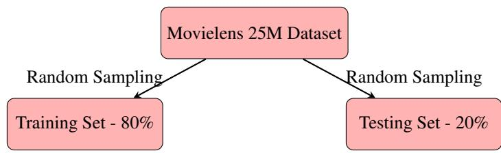

Figure 5. Dataset split into Training and Testing Sets

movies), and k is the dimensionality of the latent factors. The standard deviation of the normal distribution was set to q 1 k , ensuring appropriate scaling for the embeddings. On the other hand, all bias terms were initialized to zero.

This initialization method provides the model with a starting point of randomly distributed but appropriately scaled parameter values. Such a strategy helps stabilize training, promotes faster convergence, and improves the model's overall effectiveness.

Alternating Least Squares (ALS) is the optimization approach used to train the recommendation model. A popular iterative optimization method in recommendation systems based on matrix factorization is called ALS.

While maintaining the other parameters constant throughout the training process, the user biases and latent factors as well as the item biases and latent factors are alternately updated. Until a predetermined number of iterations is finished or a convergence condition is satisfied, this alternating method is continued iteratively.

## 4. Methods

This section describes the approach used to construct the recommendation system based on collaborative filtering.

#### 4.1. Model Description

The foundation of the recommendation system developed in this project is collaborative filtering, a popular method for using user knowledge to create tailored recommendations. The ratings matrix is broken down into lower-dimensional latent factor matrices for users and items via matrix factorization, which is the fundamental component of the model.

#### 4.1.1. OBJECTIVE AND LOSS FUNCTION

The model developed is optimized using an objective function that quantifies the difference between observed ratings and predicted ratings. A *regularized log-likelihood function* is employed, integrating the ratings matrix and regularization terms to fine-tune the model parameters. The objective function is formulated as follows :

$$\operatorname{L}=\log p(R\mid U,V)+\log p(U)+\log p(V)$$

where:

- R represents the observed rating matrix.
- U and V are the latent factor matrices for users and items, respectively.
- log p(R | U, V ) denotes the likelihood term, which measures the consistency between the observed ratings and their predictions.
- log p(U) and log p(V ) are regularization terms that constrain the complexity of latent factor matrices to prevent overfitting.

Derived from the regularized log-likelihood is a loss function which acts as the objective function optimized during the training process. It is made up of three primary components: the squared error term, the regularization term for latent vectors of the user and the item, and the regularization term for user and item biases. The loss function is mathematically defined as

$$L=-\ \frac{\lambda}{2}\sum_{m}\sum_{n\in\Omega(m)}\left(r_{mn}-\left({\bf u}_{m}^{\top}{\bf v}_{n}+b_{m}^{(u)}+b_{n}^{(i)}\right)\right)^{2}$$
 
$$-\ \frac{\tau}{2}\left(\sum_{m}{\bf u}_{m}^{\top}{\bf u}_{m}+\sum_{n}{\bf v}_{n}^{\top}{\bf v}_{n}\right)$$
 
$$-\ \frac{\gamma}{2}\left(\sum_{m}(b_{m}^{(u)})^{2}+\sum_{n}(b_{n}^{(i)})^{2}\right).\tag{1}$$

where:

- λ, τ , and γ are regularization hyperparameters that control the degree of penalty applied to the model parameters.
- b (u) m and b (i) n represent the biases for users and items, respectively.
- um and vn are the latent vectors for users and items, respectively.
- rmn denotes the observed rating for user m and item n.
- Ω(m) indicates the set of items rated by user m.

Given the loss function above, the bias term b (u) m is updated using the following formula.

$$b_{m}^{(u)}=\frac{\lambda\sum_{n\in\Omega(m)}\left(r_{mn}-\left(\mathbf{u}_{m}^{\top}\mathbf{v}_{n}+b_{n}^{(i)}\right)\right)}{\lambda|\Omega(m)|+\gamma}.\tag{2}$$

where the latent vectors (user) um are updated as :

$$\mathbf{u}_{m}=\left(\lambda\sum_{n\in\Omega(m)}\mathbf{v}_{n}\mathbf{v}_{n}^{\top}+\tau\mathbf{I}\right)^{-1}\cdot\left(\lambda\sum_{n\in\Omega(m)}\mathbf{v}_{n}\left(r_{m n}-b_{m}^{(u)}-b_{n}^{(i)}\right)\right).\tag{3}$$

The update equations described above iteratively adjust the model parameters, minimizing the loss function and improving the recommendation system's performance. The inherent symmetry between the biases and latent vectors of users and items allows the same update rules to be applied to both components.

#### 4.2. Model Training

The training process uses the Alternating Least Squares (ALS) algorithm to minimize the loss function and determine the optimal model parameters. Throughout the training, the user and item latent factor matrices, along with the user and item biases, are iteratively updated using the derived update equations. To evaluate the model performance, the root mean square error (RMSE) is employed as the primary metric, with its formula provided below.

$$\text{RMSE}_{\text{train}}=\sqrt{\frac{1}{\text{train size}}\sum_{m}\sum_{n\in\Omega(m)}\left(r_{mn}-\left(\mathbf{u}_{m}^{\top}\mathbf{v}_{n}+b_{m}^{(u)}+b_{n}^{(i)}\right)\right)^{2}}\tag{4}$$

.

### 4.2.1. TRAINING WITH BIASES ONLY

The formula below represents the loss for a model, considering only the biases:

$$L=-\ \frac{\lambda}{2}\sum_{m}\sum_{n\in\Omega(m)}\left(r_{mn}-\left(b_{m}^{(u)}+b_{n}^{(i)}\right)\right)^{2}$$
 
$$-\ \frac{\gamma}{2}\left(\sum_{m}\left(b_{m}^{(u)}\right)^{2}+\sum_{n}\left(b_{n}^{(i)}\right)^{2}\right)\tag{5}$$

Differentiating the equation above gives the bias term:

$$b_{m}^{(u)}=\frac{\lambda\sum_{n\in\Omega(m)}\left(r_{mn}-b_{n}^{(i)}\right)}{\lambda|\Omega(m)|+\gamma}.\tag{6}$$

.

Finally, the RMSE is calculated as:

$$\text{RMSE}=\sqrt{\frac{1}{\text{length of data}}\sum_{m}\sum_{n\in\Omega(m)}\left(r_{mn}-\left(b_{m}^{(u)}+b_{n}^{(i)}\right)\right)^{2}}\tag{7}$$

Algorithm 1 displays the algorithm for these processes;

#### Algorithm 1 Update Process for Biases Only

| (u) Input: User-item ratings rmn, user biases b m , item |
| --- |
| (i) biases b n , embeddings k, regularization parameters λ |
| and γ |
| Initialize: Training loss L and training RMSE Etrain |
| repeat |
| for each user m do |
| (u) using the update equation . |
| Compute b m |
| end for |
| for each item n do |
| (i) |
| Compute b using the same update equation as user n |
| bias. |
| end for |
| Compute training loss L using the objective function |
| for bias only model. |
| Compute RMSE using the formula. |
| until Maximum iterations are reached |

### 4.2.2. TRAINING WITH BIASES AND LATENT VECTORS

This project step involved including and training the latent vectors with biases. The algorithm 2 provides the algorithm to execute the model setup with biases and latent vectors included.

### 4.2.3. TRAINING AND EVALUATION SPLIT ON 25M DATASET

The recommendation model's performance was evaluated by dividing the 25 million dataset into training and testing sets. To guarantee that the rating distribution was constant between the two sets, 80% of the user-item interactions were allocated to the training set and 20% to the test set using a random sampling technique. As shown in the algorithm 3, the Alternating Least Squares (ALS) technique was used to train the model. User latent vectors, item latent vectors, item biases, and user biases were all modified in each iteration. The regularized loss function had to be minimized during the training process. Following training, the model's performance was assessed by calculating the RMSE, training and testing losses, and both.

| Algorithm 2 Update Process for Biases and Latent Vectors |
| --- |
| Input: User-item ratings rmn, user latent vectors um, |
| (u) (i) item latent vectors vn, user biases b m , item biases b n , |
| embeddings k, regularization parameters λ, τ , and γ |
| Initialize training and testing loss L and training and |
| . testing RMSE |
| repeat |
| for each user m do |
| (u) Compute b using the update equation m |
| (Equation 2) |
| Update user latent vector um using the update equa |
| tion (Equation 3) |
| end for |
| for each item n do |
| (i) using the same update equation for the |
| Compute b n |
| user bias (Equation 3) |
| Update item latent vector vn using the same update |
| equation for the user vector (Equation 3) |
| end for |
| Compute negative regularization loss L using the data |
| and the loss function (Equation 1) |
| Compute RMSE using the formula in Equation 4 |

until Maximum iterations are reached

Algorithm 3 Update Process for Biases and Latent Vectors with Train-Test Split

Input: User-item ratings rmn, user latent vectors um, item latent vectors vn, user biases b (u) m , item biases b (i) n , regularization parameters λ, τ , and γ Initialize training and testing loss L and training and testing RMSE repeat for each user m do Update b (u) m using the update equation Update user latent vector um using the update equation end for for each item n do Update b (i) n using the same update equation as for the user bias Update item latent vector vn using the same update equation as for the user vector end for Compute training loss L using the training data in the objective function from equation 1 Compute RMSE Etrain using the training data as shown in equation 4 Compute test loss L using the test data in the objective function from equation 1 Compute RMSE Etest using the test data until Maximum iterations are reached

#### 4.3. Hyperparameter Selection

Hyperparameter tuning was carried out by experimenting with a range of parameter values in a manual trial-and-error process. This iterative approach allowed for the selection of λ = 1, τ = 1, and γ = 0.001 as the most suitable hyperparameters, which produced the best results in terms of model performance.

#### 4.4. Interpreting User and Item Embeddings

To evaluate the patterns captured by the recommendation model, the learned user and item embeddings were analyzed. The model was trained with an embedding dimension of k = 2 using the 25 million dataset to enable a two-dimensional visualization of the item embeddings. This visualization helps uncover whether the model effectively distinguishes between different movie genres based on realworld knowledge.

For instance, genres like crime and comedy movies are expected to form distinct clusters in the latent space, with crime movies grouping together in a separate region from comedy movies.A degree of overlap between crime and comedy movies is expected, as elements of both genres may coexist. However, distinct separation between the clusters should still be evident, as illustrated in Figure 6. Such separation in the embedding space indicates that the model successfully captures meaningful genre-specific characteristics. By assessing these visual patterns, the quality of the learned embeddings and the overall effectiveness of the recommendation system can be evaluated.

Figure 6. Plot of learned embedding of the Crime and Comedy genre trait vectors

## 5. Results and Discussion

The outcomes of the experimental evaluation of the collaborative filtering-based recommendation system are presented in this chapter. The performance of the model is analyzed, and key insights from the experimental results are provided. λ = 1, τ = 1, and γ = 0.01 were the ideal hyperparameters used to get all of the results in this section.

#### 5.1. Results for Bias-only Model

Table 1 gives the result for training the bias only model on the 25million dataset

Table 1. Training Results for Biases-only Model

| DATASET | NEG. REG. LOSS | RMSE |
| --- | --- | --- |
| 25M DATA | 7213782.05 | 0.8493 |

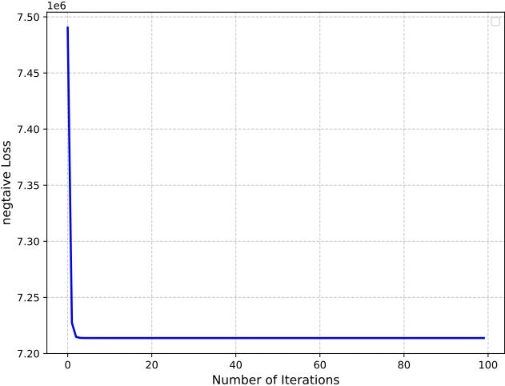

Figure 7. Neg Loss vs epochs for the training of the bias only model (25M dataset)

Table 2 gives the result on the test set for the bias only model on the 25million dataset.

Table 2. Results on the test set for Biases-only Model

| DATASET | NEG. REG. LOSS | RMSE |
| --- | --- | --- |
| 25M DATA | 1847167.99 | 0.8597 |

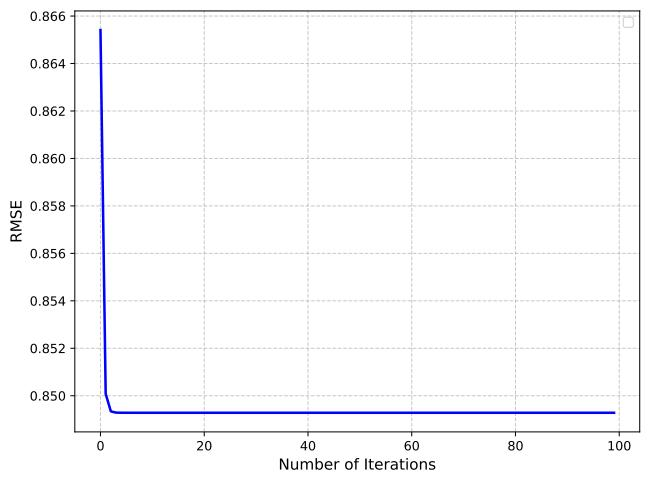

Figure 8. RMSE vs epochs for the training of the bias only model (25M dataset)

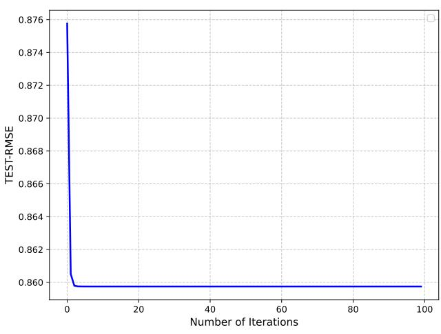

Figure 9. RMSE vs epochs for the test set of the bias only model (25M dataset)

### 5.2. Results for Varying Embedding Dimensions (k) in Biases + Latent Vectors Model

Table 3 shows the result for the two values of K used for training the bias + latent vectors model

Table 3. Results on the train set for Biases + Latent Vectors Model with Varying k

| k | DATASET | NEG. REG. LOSS | RMSE |
| --- | --- | --- | --- |
| 10 | 25M DATA | 4993962.18 | 0.6992 |
| 20 | 25M DATA | 4228440.70 | 0.6378 |

Similarly, Table 4 gives the result on the test set for the bias

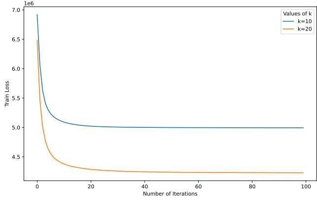

Figure 10. Loss vs epochs for the train set of the bias + latent vector model (25M dataset) for varying K values

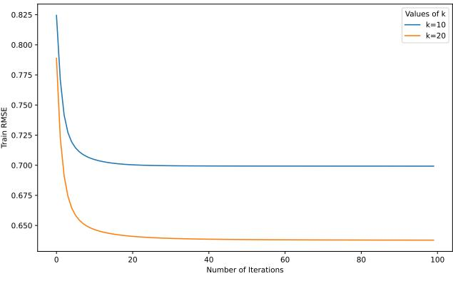

Figure 11. RMSE vs epochs for the train set of the bias + latent vector model (25M dataset) for varying K values

+ latent vector model on the 25 Million dataset.

Table 4. Results on the test set for Biases + Latent Vectors Model with Varying k

| k | DATASET | NEG. REG. LOSS | RMSE |
| --- | --- | --- | --- |
| 10 | 25M DATA | 1688029.63 | 0.7962 |
| 20 | 25M DATA | 1850641.58 | 0.8225 |

#### 5.3. Prediction Evaluation

To evaluate the model's performance in providing accurate recommendations after training, a dummy user was created, and top movie recommendations were generated for this user. This process involved calculating scores for each movie based on the learned user preferences and the movie attributes.

The following formula is used to compute the scores for each movie needed to evaluate the accuracy of the recom-

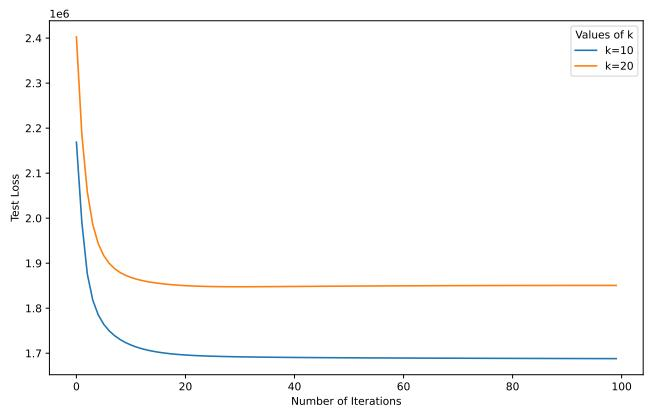

Figure 12. Loss vs epochs for the test set of the bias + latent vector model (25M dataset) for varying K values

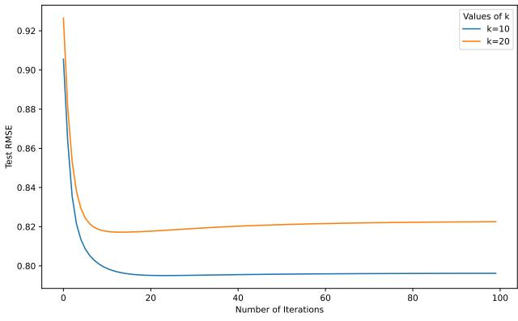

Figure 13. RMSE vs epochs for the test set of the bias + latent vector model (25M dataset) for varying K values

mendation:

scores $=\stackrel{{\star}}{{U}}\cdot V+\mu\cdot$item biases (8)

where:

- U˜ represents the newly trained user latent vectors,
- V represents the trained item latent vectors,
- µ is a regularization parameter,
- item biases represents the biases associated with each item.

The movies with the highest ratings are chosen as top suggestions. The regularization parameter µ was set to 0.001 and a minimum threshold of 300 was set as the number of interaction between a user and movies. Table 5 shows the top ten recommendations for a dummy user who gave the 'Lord of the Rings' movie a 5 star rating.

Table 5. Top 10 Movie Recommendations

| # | Movie Title |
| --- | --- |
| 1 | Lord of the Rings: The Return of the King, The (2003) |
| 2 | Lord of the Rings: The Two Towers, The (2002) |
| 3 | Lord of the Rings: The Fellowship of the Ring, The (2001) |
| 4 | Hobbit: The Desolation of Smaug, The (2013) |
| 5 | Hobbit: An Unexpected Journey, The (2012) |
| 6 | The Hobbit: The Battle of the Five Armies (2014) |
| 7 | Harry Potter and the Deathly Hallows: Part 2 (2011) |
| 8 | Harry Potter and the Half-Blood Prince (2009) |
| 9 | Harry Potter and the Deathly Hallows: Part 1 (2010) |
| 10 | Harry Potter and the Prisoner of Azkaban (2004) |

#### 5.4. Polarizing movies

Polarizing movies are those that evoke a strong and distinct reaction from viewers, leading to a sharp differentiation in user preferences. To identify the most and least polarizing films within the recommendation system, the Euclidean distance of each movie's feature vector from the origin in the latent space was calculated. This metric reflects the magnitude of a movie's characteristics in the latent space, with longer vectors signifying more polarizing attributes.

Movies with exceptionally long trait vectors are labeled as highly polarizing because they have a profound impact on identifying a user's preferences. A strong affinity or dislike for such films quickly clarifies a user's taste profile, making these movies pivotal in shaping recommendations. In contrast, movies with shorter trait vectors exhibit less distinctiveness and are categorized as less polarizing. These films generally appeal to a broader audience but provide fewer insights into individual user preferences.

The top 10 most polarizing movies based on their Euclidean distance of their trait vectors from the origin is given in Table 6.

Table 6. Top Polarizing Movies

| # | Movie Title |
| --- | --- |
| 1 | Twilight Saga: Breaking Dawn - Part 2, The (2012) |
| 2 | Dumb & Dumber (Dumb and Dumber) (1994) |
| 3 | Plan 9 from Outer Space (1959) |
| 4 | Harry Potter and the Order of the Phoenix (2007) |
| 5 | Twilight Saga: Eclipse, The (2010) |
| 6 | Harry Potter and the Deathly Hallows: Part 1 (2010) |
| 7 | Harry Potter and the Half-Blood Prince (2009) |
| 8 | Harry Potter and the Deathly Hallows: Part 2 (2011) |
| 9 | Blair Witch Project, The (1999) |
| 10 | Room, The (2003) |

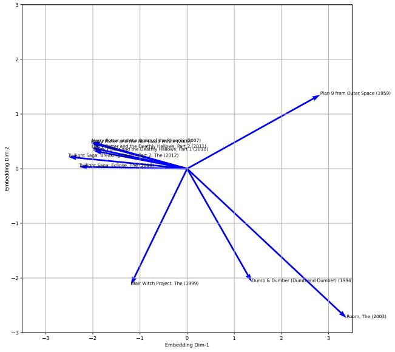

Figure 14. top polarizing movies

While the top 10 least polarizing movies are shown in Table 7.

| Table 7. Least Polarizing Movies |
| --- |

| # | Movie Title |
| --- | --- |
| 1 | Charro! (1969) |
| 2 | Man Behind the Gun, The (1953) |
| 3 | Guns of Diablo (1965) |
| 4 | What Am I Doing in the Middle of the Revolution? (1972) |
| 5 | They Don't Wear Black Tie (1980) |
| 6 | Watch Your Stern (1960) |
| 7 | Roommates (1961) |
| 8 | Home on the Rails (1981) |
| 9 | Do You Like to Read? (2012) |
| 10 | The Tip of the Iceberg (2016) |

#### 5.5. Model Assessment

This section provides a comprehensive comparison of the various modeling strategies utilized throughout the project, along with an analysis of the different hyperparameter configurations explored.

- Comparing Bias-Only Models with Bias + Latent Factors: Models using only biases exhibit faster convergence. This efficiency arises from the biases' ability to quickly account for inherent tendencies in the dataset. Models combining biases with latent factors are slower to converge due to the added complexity. However, this additional flexibility enables these models to capture more intricate patterns in the data, poten-
tially improving accuracy.

- Influence of Latent Dimension Size (k) Increasing the latent embedding dimension (k) allows the model to capture finer details and more complex relationships in the data. Larger k values increase the risk of overfitting, as the model starts capturing noise and outliers in addition to meaningful patterns.
- Effects on Test RMSE Models with higher k (e.g., k = 20) achieve lower training RMSE, but their test RMSE is typically worse, indicating overfitting as seen in table 3 and 4. Models with moderate k (e.g., k = 10) strike a better balance, offering good performance on both training and unseen data. This highlights the importance of tuning k to optimize model complexity and improve predictive accuracy.

## 6. Conclusion

This project focused on designing and evaluating a movie recommendation system utilizing matrix factorization techniques augmented with user and item embeddings. Extensive data exploration and visualization played a crucial role in uncovering the distribution patterns and unique characteristics of the dataset.

The study includes training models with various hyperparameter setups to determine their impact on performance. Models that only included biases showed faster convergence; however, adding latent vectors allowed for a more in-depth analysis of user-item interactions. It was discovered that raising the latent dimension k improved the model's ability to capture complicated patterns while also causing overfitting. This was demonstrated by the lower training RMSE and greater test RMSE when k was set to 20, compared to the improved generalization attained with k=10.

Furthermore, an examination of polarizing and nonpolarizing movies using the Euclidean distance of their trait vectors in the latent space revealed important information about user preferences and movie content diversity. These outcomes demonstrated the system's capacity to tailor recommendations while accommodating a diverse set of user preferences.

## References

- Anderson, C. *The long tail: Why the future of business is selling less of more*. Hyperion, 2006.
- Brynjolfsson, E., Hu, Y., and Smith, M. D. From niches to riches: Anatomy of the long tail. *MIT Sloan Management Review*, 47(4):67, 2006.

Gunawardana, A. and Shani, G. A survey of accuracy eval-

uation metrics of recommendation. *Journal of Machine Learning Technologies*, 6(1):37–69, 2015.

- Hastie, T., Tibshirani, R., and Friedman, J. *The elements of statistical learning: data mining, inference, and prediction*. Springer Science & Business Media, 2009.
- Koren, Y., Bell, R., and Volinsky, C. Matrix factorization techniques for recommender systems. *Computer*, 42(8): 30–37, 2009. doi: 10.1109/MC.2009.263.
- Sarwar, B. M., Karypis, G., Konstan, J. A., and Riedl, J. Item-based collaborative filtering recommendation algorithms. In *Proceedings of the 10th international conference on World Wide Web*, pp. 285–295. ACM, 2001. doi: 10.1145/371920.372071.
- Zhou, Y., Wilkinson, D., Schreiber, R., and Pan, R. Largescale parallel collaborative filtering for the netflix prize. In *International conference on algorithmic applications in management*, pp. 337–348. Springer, Berlin, Heidelberg, 2008.

